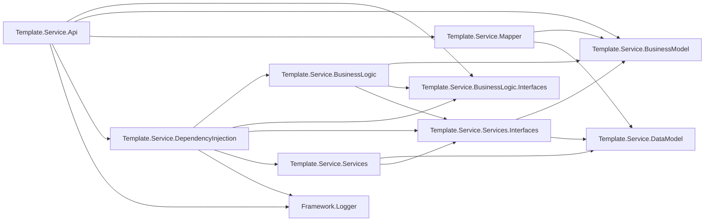
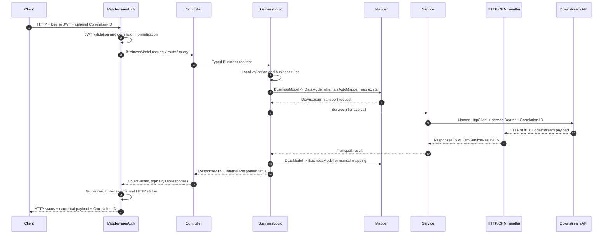
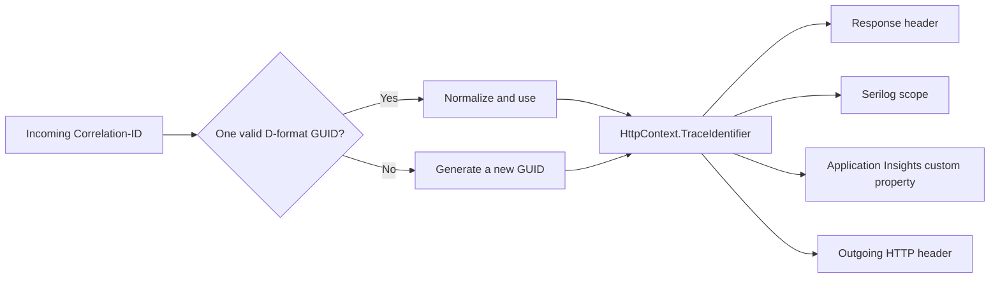

# Service.Api.Template — Umbrella Solution Architecture Document

## 1. Document purpose

This document provides a consolidated architectural and operational overview of `Service.Api.Template`. It is intended for the team taking over development, maintenance, deployment, and production support.

The document summarizes the current code state on the `development` branch as of September 4, 2026, and consolidates decisions from the existing SAD, analysis, and implementation-log documents. Current code takes precedence whenever a historical document and the implementation differ. Individual SAD documents remain the source for detailed decision history.

This document contains no real secrets, tokens, connection strings, or credentials.

## 2. Executive summary

`Service.Api.Template` is a .NET 10 intermediary API between external clients and domains/integrations such as CRM, Accounting, Product, and HR systems. Its main responsibilities are:

- protecting public business endpoints with Keycloak JWT authentication;
- validating and orchestrating business operations;
- separating public Business contracts from downstream transport contracts;
- obtaining service OAuth2 tokens for CRM and Accounting calls;
- normalizing downstream responses, errors, and HTTP statuses;
- propagating `Correlation-ID` across the request, logs, telemetry, and outbound HTTP calls;
- local file logging and Application Insights observability;
- exposing Swagger documentation in Development and UAT.

The service has no database or database migrations of its own. Business-entity state is stored in downstream systems.

Important current limitations:

- Accounting endpoints and both Training Product endpoints currently return temporary mock responses directly from controllers.
- Their BusinessLogic/Service flows exist, but the controllers do not call them yet.
- `CrmController` is an internal mock/probe flow and is hidden from API Explorer.
- Authorization currently requires an authenticated user, but no endpoint-specific role/policy rules are active.
- The existing AutoMapper 12.0.1 package reports an `NU1903` security warning.

## 3. Technology overview

| Area | Technology / approach |
|---|---|
| Runtime | .NET 10 (`net10.0`) |
| SDK pinning | `global.json`, SDK `10.0.400`, `latestPatch` |
| Web API | ASP.NET Core controllers |
| DI | Microsoft DI + Autofac composition root |
| Mapping | AutoMapper and explicit manual mapping |
| Inbound security | ASP.NET Core JWT Bearer + Keycloak |
| Outbound security | OAuth2 `client_credentials`, separate CRM and Keycloak token providers |
| HTTP integrations | Named `HttpClient` instances |
| Logging | `ILogger<T>` + Serilog file sink + Application Insights sink |
| Telemetry | Microsoft Application Insights SDK |
| API documentation | Swagger/OpenAPI + XML comments |
| Tests | xUnit, ASP.NET Core test host, fake HTTP handlers |

## 4. Solution structure

The `Template.Service.Api.sln` solution contains 12 projects.

| Project | Responsibility |
|---|---|
| `Template.Service.Api` | Host, middleware pipeline, controllers, authentication, Swagger, and HTTP status filter |
| `Template.Service.BusinessLogic` | Validation, business orchestration, response/error mapping |
| `Template.Service.BusinessLogic.Interfaces` | Business-logic interfaces |
| `Template.Service.Services` | Downstream HTTP calls, token providers, and response handlers |
| `Template.Service.Services.Interfaces` | Service interfaces, HTTP client names, and infrastructure contracts |
| `Template.Service.BusinessModel` | Public/canonical request, response, and common models |
| `Template.Service.DataModel` | Downstream/transport models, including internal CRM contracts |
| `Template.Service.Mapper` | AutoMapper profile between BusinessModel and DataModel layers |
| `Template.Service.DependencyInjection` | Composition root: Autofac registrations and named HttpClient configuration |
| `Framework.Logger` | Shared correlation-ID infrastructure within the service |
| `Template.Service.Api.Tests` | API, BL, service, mapping, DI, auth, and telemetry tests |
| `Framework.Logger.Tests` | Correlation middleware and handler tests |

### 4.1. Static dependency overview



`Service.Api.Template` is designed as an independently deployable area within the monorepository. It has no `ProjectReference` dependencies on API services outside the `Service.Api.Template` directory.

## 5. Runtime request/response flow

### 5.1. Layered flow



### 5.2. Responsibilities by layer

| Layer | Does | Should not do |
|---|---|---|
| Controller | HTTP binding, route values, header values, delegation to BL | Downstream calls and business mapping; current mocks are a temporary exception |
| BusinessLogic | Validation, orchestration, canonical errors, public response | Direct management of `HttpClient` instances |
| Mapper | Mechanical transformation of compatible DTOs | Business decisions and status mapping |
| Service | URI/query/body construction and downstream call | Expose internal CRM details through the public contract |
| HTTP handler | Transport failures, deserialization, and neutral service result | Method-specific public business messages |
| Result filter | Convert `Response<T>` outcome to the final HTTP status | Change the response body or an explicitly set non-200 status |

## 6. Models and mapping

### 6.1. Model boundaries

- `Template.Service.BusinessModel` contains public/canonical API contracts and the shared `Response<T>` envelope.
- `Template.Service.DataModel` contains downstream transport contracts, including fields that must not be exposed to clients.
- `Template.Service.Mapper/DefaultProfile.cs` contains AutoMapper configuration.
- BusinessLogic uses manual mapping when the public and CRM contracts differ semantically or internal CRM fields must be removed.

### 6.2. Current mapping strategy

AutoMapper is used for Product, CRM mock, Customer Upsert, Subscription, Accounting Event/Invoice, and Training Product models. Manual BusinessLogic mapping is used especially for:

- Organization search request/response;
- Customer company relationship;
- Customer integration profile;
- Training Registration create/read/update;
- Training Attendance event.

Rule for future changes: a new downstream DTO must not automatically become a public DTO. Define a stable BusinessModel contract first, then explicitly map only approved fields.

## 7. Authentication and authorization

### 7.1. Inbound JWT protection

`AddKeycloakAuthentication` registers JWT Bearer authentication and a global fallback authorization policy requiring an authenticated user.

The following are validated:

- HTTPS Authority/issuer;
- audience (`service-api-template` in the current configuration);
- lifetime;
- signing key;
- clock skew in the allowed 0–300 second range.

Middleware order is `UseAuthentication()` followed by `UseAuthorization()`. A missing or invalid token returns `401`.

The root status/health endpoint is explicitly anonymous. Swagger is enabled only in Development and UAT and is placed in the pipeline before authentication middleware.

### 7.2. Authorization status

There is currently no endpoint-specific role or policy authorization. `RoleClientId` exists in the configuration model, but the current registration does not build role policies from that value. Project handover must therefore distinguish between:

- authentication: implemented and globally required for controller endpoints;
- granular role/scope authorization: not implemented.

Before role authorization is introduced, confirm the Keycloak claim format, client-role location, claim mapping, and endpoint access matrix.

### 7.3. Safe authentication logging

Authentication events log the path and error type, but not the token, Authorization header, or claim values. Named HTTP clients redact the Authorization header from standard HTTP logs.

## 8. Outbound service authentication

There are two separate `client_credentials` flows.

| Downstream | Token provider | Token endpoint | Bearer handler | Cache behavior |
|---|---|---|---|---|
| CRM | `CrmAccessTokenProvider` | relative `access_token` at the CRM base address | `CrmBearerTokenHandler` | Singleton cache, early refresh, invalidation on `401` |
| Accounting | `KeycloakAccessTokenProvider` | absolute `KeycloakClient:TokenUrl` | `BearerTokenHandler` | Singleton cache, early refresh, invalidation on `401` |

The providers use a concurrency-safe `SemaphoreSlim` refresh. The refresh buffer cannot exceed half the actual token lifetime. A `401` invalidates the cache but does not automatically retry the business request.

Product and HR clients do not receive a Bearer token through these handlers.

## 9. Named HTTP clients and integrations

| Named client | Purpose | Base address key | Auth | Correlation | Timeout |
|---|---|---|---|---|---|
| `ProductApi` | Product API | `ApiPaths:ProductApiBaseAddress` | No custom bearer handler | Yes | .NET default |
| `HRApi` | HR API | `ApiPaths:HRApiBaseAddress` | No custom bearer handler | Yes | .NET default |
| `KeycloakToken` | Accounting/Keycloak token | No base address; uses absolute TokenUrl | Client credentials in body | No | 30 s |
| `CRMToken` | CRM token | `ApiPaths:CRMApiBaseAddress` | Client credentials in body | No | 30 s |
| `CRM.api` | CRM business calls | `ApiPaths:CRMApiBaseAddress` | CRM bearer | Yes | 30 s |
| `Accounting.api` | Accounting calls | `ApiPaths:AccountingApiBaseAddress` | Keycloak bearer | Yes | 30 s |

Address security rules:

- inbound Keycloak Authority, Keycloak token URL, and Accounting base address must use HTTPS;
- CRM base address may use HTTP only in Development and UAT; Production requires HTTPS;
- Product and HR currently require a valid absolute URI but have no explicit HTTPS-only validation.

No retry/circuit-breaker policy is currently registered. Retries should be introduced only for confirmed idempotent operations and in agreement with the downstream owner.

## 10. Public endpoints and current status

All controller endpoints in the table require JWT except the explicitly listed anonymous root endpoint.

| Method and route | Domain | Current execution | Downstream |
|---|---|---|---|
| `GET /` | Status/health | Anonymous; see known limitation about duplicate root registration | None |
| `POST /Product` | Legacy Product | Active full flow | Product API `users` |
| `GET /api/Crm/mock` | Internal CRM probe | Active full flow; hidden from Swagger | CRM `api/mock/customers` |
| `GET /api/v1/organizations` | Organization search | Active full flow | CRM `V8/custom/accounts` |
| `PUT /api/v1/customers/{externalCustomerId}` | Customer upsert | Active full flow | CRM `V8/custom/customers/{id}` |
| `PUT /api/v1/customers/{externalCustomerId}/company-relationship` | Company relationship | Active full flow | CRM `V8/custom/customers/{id}/company-relationship` |
| `GET /api/v1/customers/{externalCustomerId}` | Integration profile | Active full flow | CRM `V8/custom/customers/{id}` |
| `PUT /api/v1/customers/{externalCustomerId}/subscriptions/{externalSubscriptionId}` | Subscription upsert | Active full flow | CRM `V8/custom/customer-subscriptions/{subscriptionId}` |
| `GET /api/v1/training-products` | Training products list | Temporary controller mock | Service mock path exists but is not called |
| `GET /api/v1/training-products/{productCode}` | Training product detail | Temporary controller mock | Service mock path exists but is not called |
| `POST /api/v1/training-registrations` | Registration create | Active full flow | CRM `V8/custom/kpu-registrations` |
| `GET /api/v1/training-registrations/{externalRegistrationId}` | Registration read | Active full flow | CRM `V8/custom/kpu-registrations/{id}` |
| `PATCH /api/v1/training-registrations/{externalRegistrationId}` | Registration cancellation/update | Active full flow | CRM `V8/custom/kpu-registrations/{id}` |
| `POST /api/v1/training-attendance-events` | Attendance event | Active full flow | CRM `V8/custom/kpu-attendance-events` |
| `POST /api/v1/accounting/events/invoice-paid` | Invoice-paid event | Temporary controller mock | CRM mock path exists but is not called |
| `POST /v1/accounting/invoices` | Invoice creation | Temporary controller mock | Accounting mock path exists but is not called |

Note: the Accounting invoices route has no `/api` prefix, unlike most new routes. Treat any change as a breaking API decision and coordinate it with consumers before correction.

## 11. Business domains

### 11.1. Customers and organizations

- Organization search supports filters and pagination, with a separate limit for the unpaged `page=0` scenario.
- Customer upsert uses a stable external customer ID and does not expose CRM references.
- Company relationship maps controlled warnings and returns company echo data only for applicable outcome statuses.
- Integration profile returns a canonical profile without internal CRM account/contact identifiers.

### 11.2. Subscriptions and accounting

- Subscription upsert uses route IDs, the active correlation context, and a `SourceSystem` configuration fallback.
- Invoice-paid and invoice-creation BL/service implementations exist, but their public controllers are still mocked.
- The Accounting named client uses a separate Keycloak token flow.

### 11.3. KPU training

- Training registration POST/GET/PATCH use real CRM routes.
- PATCH initially supports cancellation only and strictly rejects unknown JSON properties.
- Attendance supports public `ATTENDED` and `NOT_ATTENDED` statuses; CRM-internal extensions are not exposed automatically.
- Training products public endpoints currently return mock data.

## 12. Response, errors, and HTTP statuses

### 12.1. Standard envelope

`Response<T>` contains:

- `data` — typed result or `null`;
- `messages` — warning/error messages with `type`, `code`, and `text`;
- `success` — calculated: no Error message exists;
- `hasWarnings` — calculated: a Warning exists;
- internal `Status` — `[JsonIgnore]`, used only by the HTTP status resolver.

### 12.2. Central HTTP mapping

The global MVC result filter changes the status only when the result implements `IResponse` and the current HTTP status is 200.

| Outcome | HTTP status |
|---|---:|
| `ResponseStatus.Created` | 201 |
| `ResponseStatus.BadRequest` | 400 |
| `ResponseStatus.NotFound` | 404 |
| `ResponseStatus.Conflict` | 409 |
| `ResponseStatus.UnprocessableEntity` | 422 |
| `Success == true` | 200 |
| `BUSINESS_LOGIC_ERROR` | 500 |
| `SERVICE_TIMEOUT` | 504 |
| Other unsuccessful service results | 502 |

`[ApiController]` model-binding failures may return the standard ASP.NET Core 400 format before BusinessLogic is entered; they do not necessarily use the `Response<T>` envelope.

### 12.3. CRM errors

Newer CRM flows use `CrmServiceResult<T>` and `CrmErrorMapper`:

- the service layer preserves a neutral HTTP status, safe CRM error code/detail, and transport-failure category;
- BusinessLogic selects a method-specific public code and text;
- 400/404/409/422 are mapped explicitly;
- timeout/unavailable/deserialization become safe failures without exposing the raw payload.

Older flows still use the `Response<T>`/`CrmApiResponse` handler. Migrate toward one pattern incrementally and with regression tests.

## 13. Correlation ID

The canonical HTTP header is `Correlation-ID`; the structured log/telemetry property is `CorrelationId`.



An invalid or multiple-value header is replaced by a new GUID and produces a warning without a sensitive payload. `CorrelationIdHandler` propagates the ID through Product, HR, CRM, and Accounting business clients.

Application Insights retains the standard W3C `operation_Id`; `CorrelationId` is an additional custom property and does not replace platform correlation.

## 14. Logging and observability

### 14.1. Serilog file log

- Minimum level is `Information`.
- `Microsoft.AspNetCore` level is `Warning`.
- Files are written to `Logs/applog-.txt` with a daily rolling interval.
- The output template includes timestamp, level, `CorrelationId`, message, and exception.
- Enrichment includes log context and machine name.

The path is relative to the process working directory. On Azure App Service, confirm persistent storage, retention, and the log stream/download access mechanism.

### 14.2. Application Insights

- `AddApplicationInsightsTelemetry()` collects requests, dependencies, and exceptions.
- The Serilog Application Insights sink sends `ILogger<T>` events to `traces`.
- API middleware adds the final correlation GUID to incoming `RequestTelemetry`.
- A telemetry initializer enriches dependency, trace, and other telemetry.
- The destination comes from `APPLICATIONINSIGHTS_CONNECTION_STRING` per environment/slot.

Before deployment, verify that App Service auto-instrumentation is not active alongside the code-based SDK, to avoid duplicate request/dependency records.

### 14.3. Safe logging rules

Do not log:

- Authorization/Bearer tokens;
- client secrets and connection strings;
- complete request/response bodies;
- personal data without an explicit need and approval;
- raw downstream errors that may contain internal details.

It is acceptable to log status, duration, operation, safe public/error code, and correlation ID as structured properties.

## 15. Configuration and environment variables

ASP.NET Core environment variables use `__` as the section separator, for example `Authentication__Keycloak__Authority`.

| Key | Required | Sensitive | Purpose / note |
|---|---:|---:|---|
| `ASPNETCORE_ENVIRONMENT` | Operationally yes | No | Selects Development/UAT/Production behavior and settings file; ASP.NET Core uses Production when absent |
| `Authentication__Keycloak__Authority` | Yes | No | HTTPS issuer/metadata address for inbound JWT |
| `Authentication__Keycloak__Audience` | Yes | No | Expected API audience |
| `Authentication__Keycloak__RoleClientId` | Configured | No | Reserved for role mapping; not currently used by a policy |
| `Authentication__Keycloak__ClockSkewSeconds` | Yes | No | 0–300 seconds |
| `ApiPaths__ProductApiBaseAddress` | Required at startup | No | Product named-client base URI |
| `ApiPaths__HRApiBaseAddress` | Required at startup | No | HR named-client base URI |
| `ApiPaths__CRMApiBaseAddress` | Required at startup | No | CRM token and business base URI |
| `ApiPaths__AccountingApiBaseAddress` | Required at startup | No | Accounting base URI, HTTPS-only |
| `KeycloakClient__TokenUrl` | Required at startup | No | Absolute HTTPS token URL for Accounting bearer |
| `KeycloakClient__ClientId` | Required at startup | No/identifier | Service client ID |
| `KeycloakClient__ClientSecret` | Required at startup | Yes | User Secrets/environment/Key Vault only |
| `KeycloakClient__RefreshBeforeExpirySeconds` | No | No | Default 30, range 0–300 |
| `CrmClient__ClientId` | Required at startup | No/identifier | CRM OAuth client ID |
| `CrmClient__ClientSecret` | Required at startup | Yes | User Secrets/environment/Key Vault only |
| `CrmClient__RefreshBeforeExpirySeconds` | No | No | Default 30, range 0–300 |
| `SourceSystem` | Functionally required for fallback | No | Default subscription source when the request value is missing |
| `APPLICATIONINSIGHTS_CONNECTION_STRING` | Required for Azure telemetry | Yes | Separate value per App Service/slot |

`CrmClient:TokenUrl` appears in Development JSON configuration, but the current composition root/provider does not read it; the CRM token URL is formed as `access_token` relative to `CRMApiBaseAddress`. Remove the key or support it formally in a separate, tested change.

Configuration precedence follows standard ASP.NET Core behavior: base `appsettings.json`, environment-specific JSON, User Secrets in Development, environment variables, and command-line values. Azure App Settings/Key Vault references are exposed as environment configuration and override JSON values.

## 16. Environments

| Property | Development | UAT | Production |
|---|---|---|---|
| Swagger/UI | Enabled | Enabled | Disabled |
| CRM HTTP allowed | Yes | Yes | No, HTTPS required |
| Accounting/Keycloak HTTPS | Required | Required | Required |
| Secrets | User Secrets or env | Azure App Settings/Key Vault | Azure App Settings/Key Vault |
| Application Insights | Own resource/connection string | Own resource/connection string | Own resource/connection string |

Environment-specific JSON files currently contain non-secret configuration values, while required secrets must come from outside the repository. During handover, confirm the actual Azure App Settings values and Key Vault references for each slot; they cannot be proven from the repository alone.

The planned branch/slot mapping from CI/CD documentation is:

- `development` → Azure `development` slot / DEV;
- `staging` → Azure `staging` slot / UAT;
- `main` → default slot / PROD.

The workflow is located at the monorepository root and should be verified together with OIDC federated credentials, RBAC, and GitHub secrets before ownership transfer.

## 17. Local development

### 17.1. Prerequisites

- a .NET SDK compatible with `global.json` (`10.0.400` or an allowed latest patch);
- access to required downstream systems or controlled mocks;
- valid local inbound Keycloak configuration;
- both required client secrets through User Secrets or environment variables.

### 17.2. Typical setup

```powershell
dotnet user-secrets set "KeycloakClient:ClientSecret" "<local-secret>" --project Template.Service.Api/Template.Service.Api.csproj
dotnet user-secrets set "CrmClient:ClientSecret" "<local-secret>" --project Template.Service.Api/Template.Service.Api.csproj
dotnet restore Template.Service.Api.sln -p:Configuration=Debug
dotnet build Template.Service.Api.sln --no-restore -p:Configuration=Debug
dotnet run --project Template.Service.Api/Template.Service.Api.csproj
```

Do not place real values in documentation, shared-environment shell history, or source-control files.

The local launch profile uses Development and exposes the HTTPS/HTTP addresses from `launchSettings.json`. Swagger opens at `/swagger`.

On some machines, the ambient `CONFIGURATION` variable may contain an invalid value; explicitly pass `-p:Configuration=Debug` or `Release` to dotnet commands in that case.

## 18. Build, test, and publish

Recommended local/CI flow:

```powershell
dotnet restore Template.Service.Api.sln -p:Configuration=Release
dotnet build Template.Service.Api.sln --no-restore -p:Configuration=Release
dotnet test Template.Service.Api.sln --no-build --no-restore -p:Configuration=Release
dotnet publish Template.Service.Api/Template.Service.Api.csproj -c Release -f net10.0 --no-restore
```

Main test areas:

- controller contracts and mock/active flow behavior;
- BusinessLogic validation and CRM mapping;
- service URI, body, query, and cancellation behavior;
- named-client DI and bearer-handler isolation;
- inbound JWT registration and integration scenarios;
- token cache, refresh, concurrency, and `401` invalidation;
- response handler/status filter;
- AutoMapper configuration;
- correlation middleware/handler;
- Application Insights correlation enrichment.

## 19. Deployment and post-deployment verification

The deployment artifact should be produced by publishing `Template.Service.Api/Template.Service.Api.csproj` directly. The workflow must not write runtime secrets or copy local User Secrets storage.

Minimum deployment checklist:

1. Confirm the .NET 10 runtime on the target.
2. Confirm all required App Settings/Key Vault references without displaying values.
3. Confirm the GitHub OIDC identity and RBAC over the applicable App Service slot.
4. Deploy the same tested artifact.
5. Inspect startup logs and confirm there is no fail-fast configuration error.
6. Call the anonymous health/status endpoint and one protected endpoint without a token (`401`).
7. Call a protected endpoint with a valid token.
8. Verify `Correlation-ID` in the response, file log, and Application Insights telemetry.
9. Verify at least one CRM dependency and its status/duration.
10. Confirm that duplicate Application Insights auto-instrumentation telemetry is absent.

## 20. Operational runbook

| Symptom | Checks | Likely owner/area |
|---|---|---|
| Application does not start | Startup exception and required auth/API/client keys | Service.Api.Template configuration / platform |
| All business endpoints return 401 | Authority, audience, token expiry/signature, caller token | Keycloak/caller configuration |
| Valid user receives 403 | Check newer policy changes; no role policies exist currently | Service.Api.Template auth / Keycloak roles |
| CRM call returns 401/502 | CRM client credentials, token endpoint, CRM base URI; token is invalidated without retry | CRM integration |
| 504 | Downstream timeout; find dependency by CorrelationId | Downstream service / network |
| 502 | Downstream HTTP/deserialization/unavailable failure | Service/handler/downstream contract |
| 500 with `BUSINESS_LOGIC_ERROR` | Application exception in BL; inspect trace | Service.Api.Template |
| No telemetry | `APPLICATIONINSIGHTS_CONNECTION_STRING`, SDK registration, ingestion/network | Azure/Application Insights |
| Duplicate request/dependency records | App Service auto-instrumentation versus code SDK | Azure platform |
| Correlation ID differs | Incoming format and named-client handler chain | Framework.Logger / DI |
| Mock data instead of integration | Controller TODO/mock status in endpoint table | Functional rollout |

For an incident, record at minimum the time, environment, endpoint, HTTP status, and `Correlation-ID`; do not copy a token or sensitive body into a ticket/chat.

## 21. How to extend the system

### 21.1. New endpoint

1. Define the public BusinessModel request/response.
2. Add the BusinessLogic interface and implementation with validation.
3. Define a separate DataModel for the downstream contract.
4. Add an AutoMapper map or explicit manual mapping.
5. Extend the service interface and implementation.
6. Use the correct named client; do not create an ad-hoc `HttpClient`.
7. Map errors to canonical public codes.
8. Add a controller action and `ProducesResponseType` documentation.
9. Add BL, service, controller, mapping, and status tests.
10. Update the umbrella SAD and the ticket-specific SAD.

### 21.2. New downstream service

1. Add a central client name in the services-interface project.
2. Add and fail-fast validate a separate base-address key.
3. Decide the auth handler, correlation, and timeout policy.
4. Register the client in `DependencyInjectionConfig`.
5. Redact sensitive headers.
6. Add DI and handler-isolation tests.
7. Document the environment and deployment contract without secret values.

### 21.3. New configuration value

Introduce configuration through options/central registration, validate it at startup when required, describe its source per environment, and add a test for a missing/invalid value. Never add secrets to `appsettings*.json`.

## 22. Known limitations and technical debt

1. Remove temporary controller mocks only after downstream contracts and E2E are confirmed.
2. Training Product and accounting service paths still contain `api/mock/...` routes.
3. The `CrmController`/CRM mock flow is a technical helper and not a public production contract.
4. Introduce and document an actual role/policy matrix if business authorization requires one.
5. Resolve the AutoMapper 12.0.1 `NU1903` warning through a separate verified migration.
6. Standardize the older `Response<T>` CRM handler and newer `CrmServiceResult<T>` pattern.
7. Confirm DEV/UAT/PROD E2E, especially real CRM and Accounting contracts.
8. Confirm Azure Application Insights smoke behavior and absence of duplicate telemetry.
9. Define a timeout/resilience standard per downstream service; do not add global retries.
10. Resolve the duplicate anonymous `GET /` registration (`MapGet` and `MapHealthChecks`) and preferably move health to a clear route such as `/health`.
11. Align the inconsistent Accounting invoices route (`/v1/...` without `/api`) only in coordination with consumers.
12. Remove or formalize the currently unused `CrmClient:TokenUrl` key.
13. Product/HR clients have no explicit HTTPS-only or custom timeout validation.
14. Define retention and file-log access in Azure environments.

## 23. Handover checklist

- [ ] Owners for Service.Api.Template, CRM, Accounting, Keycloak, and the Azure platform are confirmed.
- [ ] DEV/UAT/PROD URLs and network access are confirmed without adding secrets to this document.
- [ ] App Settings and Key Vault references are confirmed for every slot.
- [ ] Keycloak audience/issuer configuration and caller onboarding procedure are confirmed.
- [ ] GitHub OIDC, federated credentials, environments, approvals, and RBAC are confirmed.
- [ ] CI build/test/publish passes on a clean runner.
- [ ] Known mock endpoints have an owner and activation/removal plan.
- [ ] CRM/Accounting E2E smoke scenarios have been executed and recorded.
- [ ] Application Insights dashboard/KQL access has been transferred to the new team.
- [ ] Incident contacts, on-call channel, and downstream SLA are documented outside the source repository.

## 24. Sources and traceability

This umbrella document consolidates the following groups of existing documents under `docs/`:

| Area | Primary SAD documents |
|---|---|
| Inbound authentication | `SAD_KEYCLOAK_JWT_SERVER_en.md` |
| Outbound tokens | `SAD_KEYCLOAK_JWT_CLIENT_CRM_en.md`, `SAD_RSM_133_GET_OAUTH2_JWT_TOKEN_en.md` |
| HTTP clients | `SAD_NAMED_HTTP_CLIENT_CONFIGURATION_en.md` |
| Correlation | `SAD_CORRELATION_ID_en.md` |
| Logging/telemetry | `SAD_SERVICE_API_TEMPLATE_APPLICATION_INSIGHTS_en.md` |
| HTTP status and handlers | `SAD_CONTROLLER_RESPONSE_STATUS_FILTER_en.md`, `SAD_HTTP_RESPONSE_HANDLER_NAMESPACE_en.md` |
| Runtime | `SAD_DOTNET_10_MIGRATION_en.md` |
| Broader business flows | `SAD_RSM_146_149_152_154_157_160_163_CRM_BUSINESS_API_METHODS_en.md`, `SAD_RSM_129_131_172_174_183_BUSINESS_API_METHODS_en.md` |
| Subscription | `SAD_RSM_129_SERVISNA_INTEGRACIJA_en.md` |
| CRM mappings | `SAD_RSM_146_*`, `SAD_RSM_149_*`, `SAD_RSM_154_*`, `SAD_RSM_157_*`, `SAD_RSM_160_*`, `SAD_RSM_163_*`, `SAD_RSM_172_*`, `SAD_RSM_174_*` |

Use the applicable `*_ANALIZA_*` and `*_IMPLEMENTATION_LOG_*` documents for detailed timelines, per-ticket test results, and historical decisions. This document describes the consolidated current state and does not replace ticket history.

## 25. Maintaining this document

Update this document whenever any of the following changes:

- endpoint active/mock status;
- authentication or authorization policy;
- public or downstream contract;
- named client, token, or resilience policy;
- required configuration variable;
- environment/slot/CI-CD topology;
- logging, correlation, or telemetry flow;
- known risk affecting operational handover.

The SR and EN versions must be updated in the same pull request and must describe the same substantive state.

