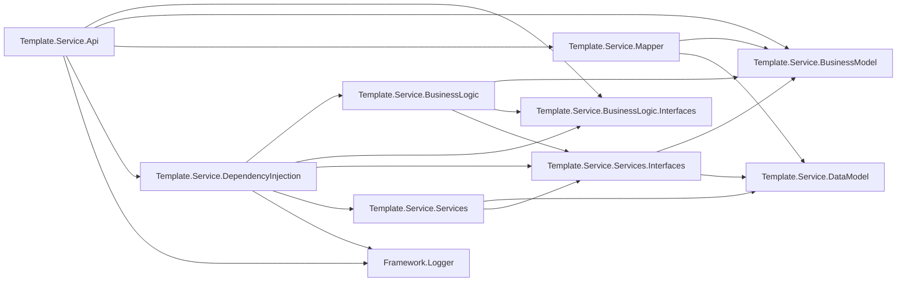
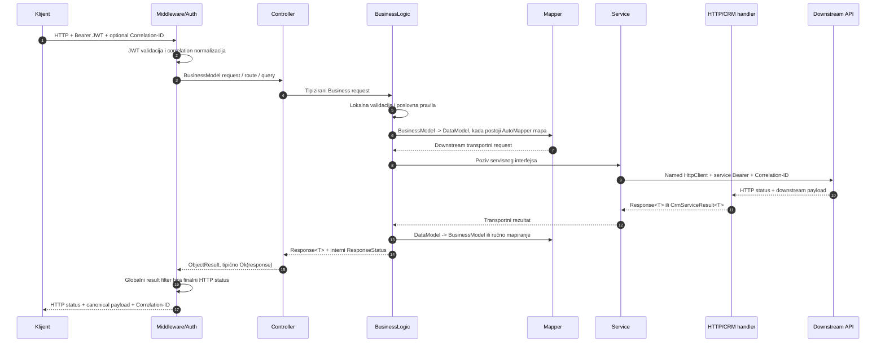
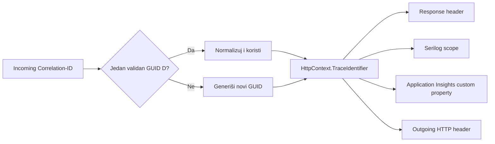

# Service.Api.Template — krovni Solution Architecture Document

## 1. Svrha dokumenta

Ovaj dokument predstavlja objedinjeni arhitektonski i operativni pregled servisa `Service.Api.Template`. Namenjen je timu koji preuzima razvoj, održavanje, deployment i produkcionu podršku.

Dokument sumira trenutno stanje koda na grani `development` na dan 4. septembra 2026. i konsoliduje odluke iz postojećih SAD, analiza i implementation-log dokumenata. Aktuelni kod ima prednost kada se istorijski dokument i implementacija razlikuju. Pojedinačni SAD dokumenti ostaju izvor detalja i istorije odluka.

Dokument ne sadrži stvarne tajne, tokene, connection stringove niti kredencijale.

## 2. Executive summary

`Service.Api.Template` je .NET 10 posrednički API između spoljašnjih klijenata i domena/integracija kao što su CRM, Accounting, Product i HR sistemi. Njegove glavne odgovornosti su:

- zaštita javnih poslovnih endpointa Keycloak JWT autentifikacijom;
- validacija i orkestracija poslovnih operacija;
- odvajanje javnih Business ugovora od downstream transportnih ugovora;
- pribavljanje servisnih OAuth2 tokena za CRM i Accounting pozive;
- normalizacija downstream odgovora, grešaka i HTTP statusa;
- propagation `Correlation-ID` kroz zahtev, logove, telemetry i odlazne HTTP pozive;
- lokalno file logovanje i Application Insights observability;
- izlaganje Swagger dokumentacije u Development i UAT okruženju.

Servis nema sopstvenu bazu podataka niti migracije. Stanje poslovnih entiteta nalazi se u downstream sistemima.

Važna trenutna ograničenja:

- Accounting endpointi i oba Training Product endpointa trenutno vraćaju privremene mock odgovore direktno iz kontrolera.
- Njihovi BusinessLogic/Service tokovi postoje, ali ih kontroleri još ne pozivaju.
- `CrmController` je interni mock/probe tok i sakriven je iz API explorer-a.
- Autorizacija trenutno zahteva autentifikovanog korisnika, ali nema aktivnih role/policy pravila po endpointu.
- Postojeći AutoMapper 12.0.1 paket prijavljuje `NU1903` security upozorenje.

## 3. Tehnološki pregled

| Oblast | Tehnologija / pristup |
|---|---|
| Runtime | .NET 10 (`net10.0`) |
| SDK pinning | `global.json`, SDK `10.0.400`, `latestPatch` |
| Web API | ASP.NET Core controllers |
| DI | Microsoft DI + Autofac composition root |
| Mapping | AutoMapper i eksplicitno ručno mapiranje |
| Inbound security | ASP.NET Core JWT Bearer + Keycloak |
| Outbound security | OAuth2 `client_credentials`, odvojeni CRM i Keycloak token provideri |
| HTTP integracije | Named `HttpClient` instance |
| Logovanje | `ILogger<T>` + Serilog file sink + Application Insights sink |
| Telemetry | Microsoft Application Insights SDK |
| API dokumentacija | Swagger/OpenAPI + XML komentari |
| Testovi | xUnit, ASP.NET Core test host, fake HTTP handleri |

## 4. Struktura solution-a

Solution `Template.Service.Api.sln` sadrži 12 projekata.

| Projekat | Odgovornost |
|---|---|
| `Template.Service.Api` | Host, middleware pipeline, kontroleri, autentifikacija, Swagger i HTTP status filter |
| `Template.Service.BusinessLogic` | Validacija, poslovna orkestracija, response/error mapiranje |
| `Template.Service.BusinessLogic.Interfaces` | Interfejsi poslovne logike |
| `Template.Service.Services` | Downstream HTTP pozivi, token provideri i response handleri |
| `Template.Service.Services.Interfaces` | Servisni interfejsi, HTTP client imena i infrastrukturni ugovori |
| `Template.Service.BusinessModel` | Javni/canonical request, response i common modeli |
| `Template.Service.DataModel` | Downstream/transportni modeli, uključujući CRM interne ugovore |
| `Template.Service.Mapper` | AutoMapper profil između BusinessModel i DataModel slojeva |
| `Template.Service.DependencyInjection` | Composition root: Autofac registracije i named HttpClient konfiguracija |
| `Framework.Logger` | Deljena correlation-ID infrastruktura unutar servisa |
| `Template.Service.Api.Tests` | API, BL, service, mapping, DI, auth i telemetry testovi |
| `Framework.Logger.Tests` | Testovi correlation middleware-a i handlera |

### 4.1. Statički dependency pregled



`Service.Api.Template` je zamišljen kao samostalno deployable područje unutar monorepozitorijuma. Ne postoje `ProjectReference` zavisnosti ka drugim API servisima van `Service.Api.Template` direktorijuma.

## 5. Runtime request/response tok

### 5.1. Slojeviti tok



### 5.2. Odgovornosti po sloju

| Sloj | Radi | Ne treba da radi |
|---|---|---|
| Controller | HTTP binding, route vrednosti, header vrednosti, delegiranje BL-u | Downstream pozive i poslovno mapiranje; trenutni mockovi su privremeni izuzetak |
| BusinessLogic | Validacija, orkestracija, canonical greške, javni response | Direktno upravljanje `HttpClient` instancama |
| Mapper | Mehanička transformacija kompatibilnih DTO-a | Poslovne odluke i status mapiranje |
| Service | URI/query/body konstrukcija, downstream poziv | Izlaganje CRM internih detalja javnom ugovoru |
| HTTP handler | Transportne greške, deserializacija i neutralan servisni rezultat | Method-specific javne poslovne poruke |
| Result filter | `Response<T>` outcome u finalni HTTP status | Menjanje tela odgovora ili eksplicitno postavljenog non-200 statusa |

## 6. Modeli i mapiranje

### 6.1. Granice modela

- `Template.Service.BusinessModel` sadrži javne/canonical API ugovore i zajednički `Response<T>` envelope.
- `Template.Service.DataModel` sadrži transportne ugovore downstream sistema, uključujući polja koja se ne smeju izložiti klijentu.
- `Template.Service.Mapper/DefaultProfile.cs` sadrži AutoMapper konfiguraciju.
- BusinessLogic koristi ručno mapiranje kada se javni i CRM ugovor semantički razlikuju ili kada interna CRM polja moraju biti uklonjena.

### 6.2. Trenutna strategija mapiranja

AutoMapper se koristi za Product, CRM mock, Customer Upsert, Subscription, Accounting Event/Invoice i Training Product modele. Ručno mapiranje u BusinessLogic sloju koristi se naročito za:

- Organization search request/response;
- Customer company relationship;
- Customer integration profile;
- Training Registration create/read/update;
- Training Attendance event.

Pravilo za buduće izmene: novi downstream DTO ne treba automatski izlagati kao javni DTO. Najpre definisati stabilan BusinessModel ugovor, zatim eksplicitno mapirati samo odobrena polja.

## 7. Autentifikacija i autorizacija

### 7.1. Inbound JWT zaštita

`AddKeycloakAuthentication` registruje JWT Bearer autentifikaciju i globalnu fallback authorization politiku koja zahteva autentifikovanog korisnika.

Validiraju se:

- HTTPS Authority/issuer;
- audience (`service-api-template` u trenutnoj konfiguraciji);
- lifetime;
- signing key;
- clock skew u dozvoljenom opsegu 0–300 sekundi.

Middleware redosled je `UseAuthentication()` pa `UseAuthorization()`. Nedostajući ili nevalidan token vraća `401`.

Root status/health endpoint je eksplicitno anoniman. Swagger je uključen samo u Development i UAT i nalazi se u pipeline-u pre authentication middleware-a.

### 7.2. Autorizacioni status

Trenutno nema endpoint-specific role ili policy autorizacije. `RoleClientId` postoji u konfiguracionom modelu, ali aktuelna registracija ne gradi role policies iz te vrednosti. Zbog toga predaja projekta mora jasno razlikovati:

- autentifikaciju: implementirana i globalno obavezna za controller endpoint-e;
- granularnu autorizaciju po rolama/scopes: nije implementirana.

Pre uvođenja role autorizacije potrebno je potvrditi Keycloak claim format, client-role lokaciju, mapiranje claim-a i matricu pristupa po endpointu.

### 7.3. Bezbedno auth logovanje

Auth događaji beleže putanju i tip greške, ali ne token, Authorization header niti claim vrednosti. Named HTTP klijenti rediguju Authorization header iz standardnih HTTP logova.

## 8. Outbound servisna autentifikacija

Postoje dva odvojena `client_credentials` toka.

| Downstream | Token provider | Token endpoint | Bearer handler | Cache ponašanje |
|---|---|---|---|---|
| CRM | `CrmAccessTokenProvider` | relativni `access_token` na CRM base adresi | `CrmBearerTokenHandler` | Singleton cache, rani refresh, invalidacija na `401` |
| Accounting | `KeycloakAccessTokenProvider` | apsolutni `KeycloakClient:TokenUrl` | `BearerTokenHandler` | Singleton cache, rani refresh, invalidacija na `401` |

Provideri koriste concurrency-safe `SemaphoreSlim` refresh. Refresh buffer ne može biti veći od polovine stvarnog token lifetime-a. `401` invalidira cache, ali poslovni zahtev se ne ponavlja automatski.

Product i HR klijenti ne dobijaju Bearer token kroz ove handlere.

## 9. Named HTTP klijenti i integracije

| Named client | Namena | Base address key | Auth | Correlation | Timeout |
|---|---|---|---|---|---|
| `ProductApi` | Product API | `ApiPaths:ProductApiBaseAddress` | Nema custom bearer handler | Da | .NET podrazumevani |
| `HRApi` | HR API | `ApiPaths:HRApiBaseAddress` | Nema custom bearer handler | Da | .NET podrazumevani |
| `KeycloakToken` | Accounting/Keycloak token | Nema base adrese; koristi apsolutni TokenUrl | Client credentials u body-ju | Ne | 30 s |
| `CRMToken` | CRM token | `ApiPaths:CRMApiBaseAddress` | Client credentials u body-ju | Ne | 30 s |
| `CRM.api` | CRM poslovni pozivi | `ApiPaths:CRMApiBaseAddress` | CRM bearer | Da | 30 s |
| `Accounting.api` | Accounting pozivi | `ApiPaths:AccountingApiBaseAddress` | Keycloak bearer | Da | 30 s |

Bezbednosna pravila adresa:

- inbound Keycloak Authority, Keycloak token URL i Accounting base address moraju biti HTTPS;
- CRM base address sme biti HTTP samo u Development i UAT; Production zahteva HTTPS;
- Product i HR trenutno zahtevaju validan apsolutni URI, ali nemaju eksplicitnu HTTPS-only validaciju.

Retry/circuit-breaker politika trenutno nije registrovana. Retry treba uvoditi samo za potvrđeno idempotentne operacije i uz dogovor sa downstream vlasnikom.

## 10. Javni endpointi i trenutno stanje

Svi controller endpointi iz tabele zahtevaju JWT osim eksplicitno navedenog anonimnog root endpointa.

| Metod i ruta | Domen | Trenutno izvršavanje | Downstream |
|---|---|---|---|
| `GET /` | Status/health | Anonimno; vidi poznato ograničenje za duplu root registraciju | Nema |
| `POST /Product` | Legacy Product | Aktivan puni tok | Product API `users` |
| `GET /api/Crm/mock` | Interni CRM probe | Aktivan puni tok; sakriven iz Swagger-a | CRM `api/mock/customers` |
| `GET /api/v1/organizations` | Organization search | Aktivan puni tok | CRM `V8/custom/accounts` |
| `PUT /api/v1/customers/{externalCustomerId}` | Customer upsert | Aktivan puni tok | CRM `V8/custom/customers/{id}` |
| `PUT /api/v1/customers/{externalCustomerId}/company-relationship` | Company relationship | Aktivan puni tok | CRM `V8/custom/customers/{id}/company-relationship` |
| `GET /api/v1/customers/{externalCustomerId}` | Integration profile | Aktivan puni tok | CRM `V8/custom/customers/{id}` |
| `PUT /api/v1/customers/{externalCustomerId}/subscriptions/{externalSubscriptionId}` | Subscription upsert | Aktivan puni tok | CRM `V8/custom/customer-subscriptions/{subscriptionId}` |
| `GET /api/v1/training-products` | Training products list | Privremeni controller mock | Servisni mock put postoji, ali se ne poziva |
| `GET /api/v1/training-products/{productCode}` | Training product detail | Privremeni controller mock | Servisni mock put postoji, ali se ne poziva |
| `POST /api/v1/training-registrations` | Registration create | Aktivan puni tok | CRM `V8/custom/kpu-registrations` |
| `GET /api/v1/training-registrations/{externalRegistrationId}` | Registration read | Aktivan puni tok | CRM `V8/custom/kpu-registrations/{id}` |
| `PATCH /api/v1/training-registrations/{externalRegistrationId}` | Registration cancellation/update | Aktivan puni tok | CRM `V8/custom/kpu-registrations/{id}` |
| `POST /api/v1/training-attendance-events` | Attendance event | Aktivan puni tok | CRM `V8/custom/kpu-attendance-events` |
| `POST /api/v1/accounting/events/invoice-paid` | Invoice-paid event | Privremeni controller mock | CRM mock put postoji, ali se ne poziva |
| `POST /v1/accounting/invoices` | Invoice creation | Privremeni controller mock | Accounting mock put postoji, ali se ne poziva |

Napomena: Accounting invoices ruta nema prefiks `/api`, za razliku od većine novih ruta. Promenu tretirati kao breaking API odluku i uskladiti sa potrošačima pre korekcije.

## 11. Poslovni domeni

### 11.1. Customers i organizations

- Organization pretraga podržava filtere i paginaciju, uz posebnu granicu za unpaged `page=0` scenario.
- Customer upsert koristi stabilan eksterni customer ID i ne izlaže CRM reference.
- Company relationship mapira kontrolisane warnings i vraća company echo samo za odgovarajuće statusne ishode.
- Integration profile vraća canonical profil bez internih CRM account/contact identifikatora.

### 11.2. Subscriptions i accounting

- Subscription upsert koristi route ID-eve, aktivni correlation context i `SourceSystem` fallback iz konfiguracije.
- Invoice-paid i invoice-creation BL/service implementacije postoje, ali su javni kontroleri još mockovani.
- Accounting named client koristi poseban Keycloak token tok.

### 11.3. KPU training

- Training registration POST/GET/PATCH koriste stvarne CRM rute.
- PATCH početno podržava samo cancellation i striktno odbija nepoznata JSON polja.
- Attendance podržava javne statuse `ATTENDED` i `NOT_ATTENDED`; CRM-interna proširenja se ne izlažu automatski.
- Training products javni endpointi trenutno vraćaju mock podatke.

## 12. Response, greške i HTTP statusi

### 12.1. Standardni envelope

`Response<T>` sadrži:

- `data` — tipizirani rezultat ili `null`;
- `messages` — warning/error poruke sa `type`, `code` i `text`;
- `success` — izračunato: nema poruke tipa Error;
- `hasWarnings` — izračunato: postoji Warning;
- interni `Status` — `[JsonIgnore]`, koristi ga samo HTTP status resolver.

### 12.2. Centralno HTTP mapiranje

Globalni MVC result filter menja status samo kada je rezultat `IResponse` i trenutni HTTP status je 200.

| Outcome | HTTP status |
|---|---:|
| `ResponseStatus.Created` | 201 |
| `ResponseStatus.BadRequest` | 400 |
| `ResponseStatus.NotFound` | 404 |
| `ResponseStatus.Conflict` | 409 |
| `ResponseStatus.UnprocessableEntity` | 422 |
| `Success == true` | 200 |
| `BUSINESS_LOGIC_ERROR` | 500 |
| `SERVICE_TIMEOUT` | 504 |
| Ostali neuspešni servisni rezultati | 502 |

`[ApiController]` model-binding greške mogu vratiti standardni ASP.NET Core 400 format pre ulaska u BusinessLogic; ne moraju imati `Response<T>` envelope.

### 12.3. CRM greške

Noviji CRM tokovi koriste `CrmServiceResult<T>` i `CrmErrorMapper`:

- servisni sloj čuva neutralan HTTP status, bezbedan CRM error kod/detail i transport-failure kategoriju;
- BusinessLogic bira method-specific javni kod i tekst;
- 400/404/409/422 se mapiraju eksplicitno;
- timeout/unavailable/deserialization postaju bezbedan neuspeh bez izlaganja raw payload-a.

Stariji tokovi i dalje koriste `Response<T>`/`CrmApiResponse` handler. Migraciju na jedan obrazac raditi postepeno i uz regresione testove.

## 13. Correlation ID

Kanonski HTTP header je `Correlation-ID`, a strukturirano log/telemetry svojstvo `CorrelationId`.



Nevalidan ili višestruk header se zamenjuje novim GUID-em i beleži se warning bez osetljivog payload-a. `CorrelationIdHandler` prosleđuje ID kroz Product, HR, CRM i Accounting poslovne klijente.

Application Insights zadržava standardni W3C `operation_Id`; `CorrelationId` je dodatno custom svojstvo i ne zamenjuje platformsku korelaciju.

## 14. Logovanje i observability

### 14.1. Serilog file log

- Minimalni nivo je `Information`.
- `Microsoft.AspNetCore` nivo je `Warning`.
- Fajlovi se pišu u `Logs/applog-.txt` sa dnevnim rolling intervalom.
- Output template sadrži timestamp, nivo, `CorrelationId`, poruku i exception.
- Enrichment uključuje log context i machine name.

Lokacija je relativna u odnosu na process working directory. Na Azure App Service-u treba potvrditi persistent storage, retention i pristup log stream/download mehanizmu.

### 14.2. Application Insights

- `AddApplicationInsightsTelemetry()` prikuplja requests, dependencies i exceptions.
- Serilog Application Insights sink šalje `ILogger<T>` događaje u `traces`.
- API middleware upisuje finalni correlation GUID u incoming `RequestTelemetry`.
- Telemetry initializer dopunjava dependency, trace i ostalu telemetry.
- Destination dolazi iz `APPLICATIONINSIGHTS_CONNECTION_STRING` po okruženju/slotu.

Pre deploymenta proveriti da App Service auto-instrumentation nije paralelno aktivan sa code-based SDK-om, kako ne bi nastali dupli request/dependency zapisi.

### 14.3. Pravila bezbednog logovanja

Ne logovati:

- Authorization/Bearer tokene;
- client secrets i connection stringove;
- kompletne request/response body-jeve;
- lične podatke bez eksplicitne potrebe i odobrenja;
- sirove downstream greške koje mogu sadržati interne detalje.

Dozvoljeno je strukturirano logovati status, trajanje, operaciju, bezbedan javni/error kod i correlation ID.

## 15. Konfiguracija i environment varijable

ASP.NET Core environment varijable koriste `__` kao separator sekcija, na primer `Authentication__Keycloak__Authority`.

| Ključ | Obavezan | Osetljiv | Namena / napomena |
|---|---:|---:|---|
| `ASPNETCORE_ENVIRONMENT` | Operativno da | Ne | Bira Development/UAT/Production ponašanje i settings fajl; bez vrednosti ASP.NET Core koristi Production |
| `Authentication__Keycloak__Authority` | Da | Ne | HTTPS issuer/metadata adresa za inbound JWT |
| `Authentication__Keycloak__Audience` | Da | Ne | Očekivani API audience |
| `Authentication__Keycloak__RoleClientId` | Konfigurisan | Ne | Rezervisano za role mapiranje; trenutno se ne koristi za policy |
| `Authentication__Keycloak__ClockSkewSeconds` | Da | Ne | 0–300 sekundi |
| `ApiPaths__ProductApiBaseAddress` | Da pri startup-u | Ne | Product named client base URI |
| `ApiPaths__HRApiBaseAddress` | Da pri startup-u | Ne | HR named client base URI |
| `ApiPaths__CRMApiBaseAddress` | Da pri startup-u | Ne | CRM token i business base URI |
| `ApiPaths__AccountingApiBaseAddress` | Da pri startup-u | Ne | Accounting base URI, HTTPS-only |
| `KeycloakClient__TokenUrl` | Da pri startup-u | Ne | Apsolutni HTTPS token URL za Accounting bearer |
| `KeycloakClient__ClientId` | Da pri startup-u | Ne/identifikator | Service client ID |
| `KeycloakClient__ClientSecret` | Da pri startup-u | Da | Samo User Secrets/environment/Key Vault |
| `KeycloakClient__RefreshBeforeExpirySeconds` | Ne | Ne | Default 30, opseg 0–300 |
| `CrmClient__ClientId` | Da pri startup-u | Ne/identifikator | CRM OAuth client ID |
| `CrmClient__ClientSecret` | Da pri startup-u | Da | Samo User Secrets/environment/Key Vault |
| `CrmClient__RefreshBeforeExpirySeconds` | Ne | Ne | Default 30, opseg 0–300 |
| `SourceSystem` | Funkcionalno potrebno za fallback | Ne | Default source za subscription kada request vrednost nedostaje |
| `APPLICATIONINSIGHTS_CONNECTION_STRING` | Potrebno za Azure telemetry | Da | Posebna vrednost po App Service-u/slotu |

`CrmClient:TokenUrl` se pojavljuje u Development JSON konfiguraciji, ali ga trenutni composition root/provider ne čita; CRM token URL se formira kao `access_token` relativno na `CRMApiBaseAddress`. Ključ treba ukloniti ili formalno podržati u zasebnoj, testiranoj izmeni.

Konfiguracioni precedence je standardni ASP.NET Core: bazni `appsettings.json`, environment-specific JSON, User Secrets u Development-u, environment varijable i command-line vrednosti. Azure App Settings/Key Vault reference se izlažu aplikaciji kao environment konfiguracija i imaju prednost nad JSON vrednostima.

## 16. Okruženja

| Osobina | Development | UAT | Production |
|---|---|---|---|
| Swagger/UI | Uključen | Uključen | Isključen |
| CRM HTTP dozvoljen | Da | Da | Ne, HTTPS obavezan |
| Accounting/Keycloak HTTPS | Obavezan | Obavezan | Obavezan |
| Secrets | User Secrets ili env | Azure App Settings/Key Vault | Azure App Settings/Key Vault |
| Application Insights | Sopstveni resurs/connection string | Sopstveni resurs/connection string | Sopstveni resurs/connection string |

Environment-specific JSON fajlovi trenutno sadrže ne-secret konfiguracione vrednosti, dok obavezni secrets moraju doći spolja. Pri predaji obavezno potvrditi stvarne Azure App Settings vrednosti i Key Vault reference za svaki slot; one se ne mogu dokazati samo iz repozitorijuma.

Planirano branch/slot mapiranje iz CI/CD dokumentacije je:

- `development` → Azure `development` slot / DEV;
- `staging` → Azure `staging` slot / UAT;
- `main` → default slot / PROD.

Workflow se nalazi na monorepo root nivou i treba ga proveriti zajedno sa OIDC federated credential-om, RBAC-om i GitHub secrets pre ownership transfera.

## 17. Lokalni razvoj

### 17.1. Preduslovi

- .NET SDK kompatibilan sa `global.json` (`10.0.400` ili dozvoljeni latest patch);
- pristup potrebnim downstream sistemima ili kontrolisanim mockovima;
- validna lokalna inbound Keycloak konfiguracija;
- oba obavezna client secret-a kroz User Secrets ili environment varijable.

### 17.2. Tipičan setup

```powershell
dotnet user-secrets set "KeycloakClient:ClientSecret" "<local-secret>" --project Template.Service.Api/Template.Service.Api.csproj
dotnet user-secrets set "CrmClient:ClientSecret" "<local-secret>" --project Template.Service.Api/Template.Service.Api.csproj
dotnet restore Template.Service.Api.sln -p:Configuration=Debug
dotnet build Template.Service.Api.sln --no-restore -p:Configuration=Debug
dotnet run --project Template.Service.Api/Template.Service.Api.csproj
```

Ne stavljati stvarne vrednosti u dokumentaciju, shell history deljenog okruženja ili source-control fajlove.

Lokalni launch profil koristi Development i izlaže HTTPS/HTTP adrese iz `launchSettings.json`. Swagger se otvara na `/swagger`.

Na pojedinim računarima ambient `CONFIGURATION` varijabla može sadržati nevažeću vrednost; tada u dotnet komandama eksplicitno zadati `-p:Configuration=Debug` ili `Release`.

## 18. Build, test i publish

Preporučeni lokalni/CI tok:

```powershell
dotnet restore Template.Service.Api.sln -p:Configuration=Release
dotnet build Template.Service.Api.sln --no-restore -p:Configuration=Release
dotnet test Template.Service.Api.sln --no-build --no-restore -p:Configuration=Release
dotnet publish Template.Service.Api/Template.Service.Api.csproj -c Release -f net10.0 --no-restore
```

Glavne test oblasti:

- controller ugovori i mock/active flow ponašanje;
- BusinessLogic validacija i CRM mapiranje;
- service URI, body, query i cancellation ponašanje;
- named-client DI i izolacija bearer handlera;
- inbound JWT registracija i integracioni scenariji;
- token cache, refresh, concurrency i `401` invalidacija;
- response handler/status filter;
- AutoMapper konfiguracija;
- correlation middleware/handler;
- Application Insights correlation enrichment.

## 19. Deployment i post-deployment provera

Deployment artifact treba da nastane direktnim publish-om `Template.Service.Api/Template.Service.Api.csproj`. Workflow ne treba da upisuje runtime secrets niti da kopira lokalni User Secrets storage.

Minimalna deployment checklista:

1. Potvrditi .NET 10 runtime na targetu.
2. Potvrditi sve obavezne App Settings/Key Vault reference bez prikazivanja vrednosti.
3. Potvrditi GitHub OIDC identity i RBAC nad odgovarajućim App Service slotom.
4. Deployovati isti testirani artifact.
5. Proveriti startup log i odsustvo fail-fast configuration greške.
6. Pozvati anonimni health/status endpoint i jedan zaštićeni endpoint bez tokena (`401`).
7. Pozvati zaštićeni endpoint validnim tokenom.
8. Proveriti `Correlation-ID` u response-u, file logu i Application Insights telemetry.
9. Proveriti bar jedan CRM dependency i njegov status/duration.
10. Proveriti da nema duple Application Insights auto-instrumentation telemetry.

## 20. Operativni runbook

| Simptom | Provere | Verovatan vlasnik/oblast |
|---|---|---|
| Aplikacija ne startuje | Startup exception i obavezni auth/API/client ključevi | Service.Api.Template konfiguracija / platforma |
| Svi business endpointi vraćaju 401 | Authority, audience, token expiry/signature, caller token | Keycloak/caller konfiguracija |
| Validan korisnik dobija 403 | Proveriti novije policy izmene; trenutno nema role policies | Service.Api.Template auth / Keycloak roles |
| CRM poziv vraća 401/502 | CRM client credentials, token endpoint, CRM base URI; token se invalidira bez retry-a | CRM integracija |
| 504 | Downstream timeout; pronaći dependency po CorrelationId | Downstream servis / mreža |
| 502 | Downstream HTTP/deserialization/unavailable greška | Service/handler/downstream ugovor |
| 500 sa `BUSINESS_LOGIC_ERROR` | Aplikacioni exception u BL-u; proveriti trace | Service.Api.Template |
| Nema telemetry | `APPLICATIONINSIGHTS_CONNECTION_STRING`, SDK registracija, ingestion/network | Azure/Application Insights |
| Dupli request/dependency zapisi | App Service auto-instrumentation naspram code SDK-a | Azure platforma |
| Correlation ID se razlikuje | Proveriti incoming format i handler chain named klijenta | Framework.Logger / DI |
| Mock podaci umesto integracije | Proveriti controller TODO/mock status iz endpoint tabele | Funkcionalni rollout |

Za incident je minimalno potrebno zabeležiti vreme, okruženje, endpoint, HTTP status i `Correlation-ID`; ne kopirati token ili osetljiv body u tiket/chat.

## 21. Kako proširiti sistem

### 21.1. Novi endpoint

1. Definisati javni BusinessModel request/response.
2. Dodati BusinessLogic interfejs i implementaciju sa validacijom.
3. Definisati odvojeni DataModel za downstream ugovor.
4. Dodati AutoMapper mapu ili eksplicitno ručno mapiranje.
5. Proširiti servisni interfejs i implementaciju.
6. Koristiti odgovarajući named client; ne kreirati ad-hoc `HttpClient`.
7. Mapirati greške u canonical javne kodove.
8. Dodati controller action i `ProducesResponseType` dokumentaciju.
9. Dodati BL, service, controller, mapping i status testove.
10. Ažurirati krovni SAD i namenski ticket SAD.

### 21.2. Novi downstream servis

1. Dodati centralno ime klijenta u services-interface projektu.
2. Dodati i fail-fast validirati zaseban base-address ključ.
3. Odlučiti auth handler, correlation i timeout politiku.
4. Registrovati klijent u `DependencyInjectionConfig`.
5. Redigovati osetljive headere.
6. Dodati DI i handler-isolation testove.
7. Dokumentovati environment i deployment ugovor bez secret vrednosti.

### 21.3. Nova konfiguraciona vrednost

Konfiguraciju uvoditi kroz options/centralnu registraciju, validirati pri startup-u kada je obavezna, opisati izvor po okruženju i dodati test za nedostajuću/nevalidnu vrednost. Tajne nikada ne dodavati u `appsettings*.json`.

## 22. Poznata ograničenja i tehnički dug

1. Ukloniti privremene controller mockove tek kada su downstream ugovori i E2E potvrđeni.
2. Training Product i accounting servisne putanje još sadrže `api/mock/...` rute.
3. `CrmController`/CRM mock tok je tehnička pomoćna funkcija i nije javni produkcioni ugovor.
4. Uvesti i dokumentovati stvarnu role/policy matricu ako poslovna autorizacija to zahteva.
5. Razrešiti AutoMapper 12.0.1 `NU1903` upozorenje kroz zasebnu proverenu migraciju.
6. Standardizovati stari `Response<T>` CRM handler i noviji `CrmServiceResult<T>` obrazac.
7. Potvrditi DEV/UAT/PROD E2E, naročito stvarne CRM i Accounting ugovore.
8. Potvrditi Azure Application Insights smoke i odsustvo duple telemetry.
9. Razmotriti timeout/resilience standard po downstream servisu; retry ne uvoditi globalno.
10. Razrešiti duplu anonimnu `GET /` registraciju (`MapGet` i `MapHealthChecks`) i po mogućstvu health endpoint premestiti na jasnu putanju kao `/health`.
11. Uskladiti nekonzistentnu Accounting invoices rutu (`/v1/...` bez `/api`) samo uz koordinaciju sa potrošačima.
12. Ukloniti ili formalizovati trenutno nekorišćeni `CrmClient:TokenUrl` ključ.
13. Product/HR klijenti nemaju eksplicitnu HTTPS-only ni custom timeout validaciju.
14. Definisati retention i pristup file logovima u Azure okruženjima.

## 23. Handover checklista

- [ ] Potvrđeni vlasnici za Service.Api.Template, CRM, Accounting, Keycloak i Azure platformu.
- [ ] Potvrđeni DEV/UAT/PROD URL-ovi i mrežni pristup bez unošenja tajni u dokument.
- [ ] Potvrđene App Settings i Key Vault reference za svaki slot.
- [ ] Potvrđena Keycloak audience/issuer konfiguracija i caller onboarding postupak.
- [ ] Potvrđeni GitHub OIDC, federated credentials, environments, approvals i RBAC.
- [ ] CI build/test/publish prolazi na čistom runner-u.
- [ ] Poznati mock endpointi imaju vlasnika i plan aktivacije/uklanjanja.
- [ ] CRM/Accounting E2E smoke scenariji su izvršeni i zabeleženi.
- [ ] Application Insights dashboard/KQL pristup je prenet novom timu.
- [ ] Incident kontakti, on-call kanal i SLA za downstream sisteme su dokumentovani van source repozitorijuma.

## 24. Izvori i traceability

Krovni dokument konsoliduje sledeće grupe postojećih dokumenata u `docs/`:

| Oblast | Primarni SAD dokumenti |
|---|---|
| Inbound autentifikacija | `SAD_KEYCLOAK_JWT_SERVER_sr.md` |
| Outbound tokeni | `SAD_KEYCLOAK_JWT_CLIENT_CRM_sr.md`, `SAD_RSM_133_GET_OAUTH2_JWT_TOKEN_sr.md` |
| HTTP klijenti | `SAD_NAMED_HTTP_CLIENT_CONFIGURATION_sr.md` |
| Correlation | `SAD_CORRELATION_ID_sr.md` |
| Logging/telemetry | `SAD_SERVICE_API_TEMPLATE_APPLICATION_INSIGHTS_sr.md` |
| HTTP status i handleri | `SAD_CONTROLLER_RESPONSE_STATUS_FILTER_sr.md`, `SAD_HTTP_RESPONSE_HANDLER_NAMESPACE_sr.md` |
| Runtime | `SAD_DOTNET_10_MIGRATION_sr.md` |
| Širi poslovni tokovi | `SAD_RSM_146_149_152_154_157_160_163_CRM_BUSINESS_API_METHODS_sr.md`, `SAD_RSM_129_131_172_174_183_BUSINESS_API_METHODS_sr.md` |
| Subscription | `SAD_RSM_129_SERVISNA_INTEGRACIJA_sr.md` |
| CRM mapiranja | `SAD_RSM_146_*`, `SAD_RSM_149_*`, `SAD_RSM_154_*`, `SAD_RSM_157_*`, `SAD_RSM_160_*`, `SAD_RSM_163_*`, `SAD_RSM_172_*`, `SAD_RSM_174_*` |

Za detaljan timeline, test rezultate po tiketu i istorijske odluke koristiti odgovarajuće `*_ANALIZA_*` i `*_IMPLEMENTATION_LOG_*` dokumente. Ovaj dokument opisuje objedinjeno trenutno stanje, a ne zamenjuje ticket istoriju.

## 25. Održavanje ovog dokumenta

Dokument ažurirati kada se promeni bilo šta od sledećeg:

- aktivni/mock status endpointa;
- autentifikaciona ili autorizaciona politika;
- javni ili downstream ugovor;
- named client, token ili resilience politika;
- obavezna konfiguraciona promenljiva;
- environment/slot/CI-CD topologija;
- logging, correlation ili telemetry tok;
- poznati rizik koji utiče na operativno preuzimanje.

SR i EN verzija moraju biti izmenjene u istom pull request-u i sadržati isto suštinsko stanje.

